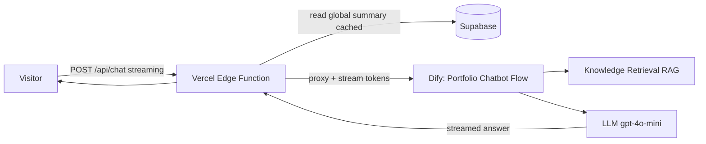

# AI Portfolio Assistant

An AI assistant embedded in my portfolio site that answers questions about my
career, projects, and work style — grounded in my own knowledge base (RAG),
not the open web.

**Live demo:** https://jinyufish-github-io.vercel.app — open the chat and ask
*"What does Jessy do?"*

---

## Architecture

Two paths:

- **Chat (runtime).** Static frontend → a Vercel edge function
  (`api/chat.js`) that injects my precomputed profile summary and proxies to a
  Dify RAG workflow, streaming tokens straight back to the browser.
- **Knowledge authoring (offline).** When I have new info, a separate Dify
  workflow rewrites a fixed "knowledge skeleton" with an LLM and versions it
  into Supabase — so the chat always reads a clean, up-to-date summary.

## Components

| Piece | What it does |
|---|---|
| `public/index.html` | Portfolio site + embedded chat widget (SSE streaming, bilingual EN/中文) |
| `api/chat.js` | Vercel edge proxy: injects profile summary, streams Dify output |
| `api/suggest.js` | Generates follow-up question suggestions |
| `dify/portfolio-chatbot-flow.yml` | Dify RAG chat workflow (retrieval → LLM) |
| `dify/global-knowledge-summary.yml` | Dify workflow that maintains the profile summary in Supabase |

## Engineering notes

- **Token streaming** end to end so the first words appear as soon as the model
  starts generating, instead of waiting for the full answer.
- **Stale-while-revalidate cache** for the profile summary — a warm request
  never blocks on the database; it serves the cached copy and refreshes in the
  background.
- **Warm-up on intent** — the frontend pings the function when a visitor hovers
  the chat, so their first message skips the cold-start delay.
- **Secrets stay out of the repo** — all API keys and the Supabase key live in
  Vercel environment variables and Dify secrets; the Dify exports here use
  `{{#env.*#}}` placeholders.

## Stack

Vercel Edge Functions · Dify (RAG + workflow orchestration) · Supabase ·
OpenAI `gpt-4o-mini` · vanilla JS frontend
